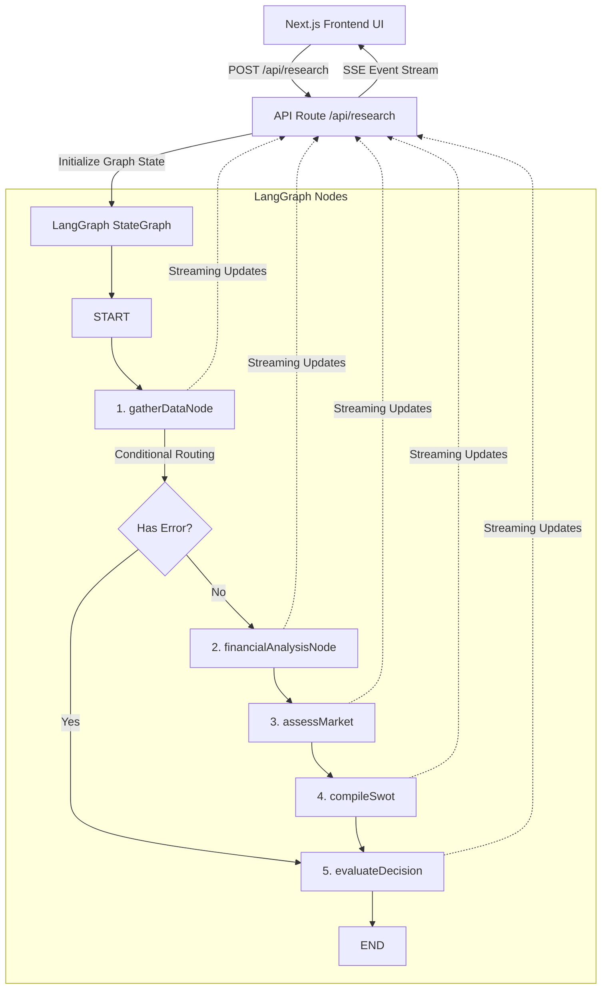

# AI Investment Research Agent - Take-Home Assignment

This repository contains the complete implementation of the **AI Investment Research Agent** built for the InsideIIM × Altuni AI Labs take-home assignment.

---

## 🌟 Overview

The **AI Investment Research Agent** is a full-stack web application designed to act as an autonomous investment committee. It takes any company name, conducts multi-phase research, and outputs a final decision (**INVEST** or **PASS**) with an analyst consensus rating (0-100) and a detailed strategic investment thesis.

### Key Features
*   **Multi-Node Agentic Architecture:** Powered by **LangGraph.js**, the agent structures its thinking sequentially: Ticker Resolution & Web Scraping $\rightarrow$ Financial Analysis $\rightarrow$ Strategic Moat Assessment $\rightarrow$ SWOT Formulation $\rightarrow$ Investment Committee Verdict.
*   **Real-time Mind-streaming:** Features a live terminal log on the UI showing the step-by-step progress and thoughts of the agent as it moves through nodes.
*   **Data-Driven Dashboards:** Shows a visual, dark-themed, glassmorphic dashboard with radial meters for 5 pillars (Growth, Valuation, Quality, Moat, Risk), an interactive 2x2 SWOT grid, key financial ratios (Market Cap, P/E, Margins), and referenced sources.
*   **Zero-Setup Dynamic Demo Mode:** **(Highly Critical)** If no API keys are configured, the application automatically enters **Demo Mode**. It still fetches **live financial metrics** from Yahoo Finance and uses a rule-based mock analyst engine to write realistic, metrics-aligned reports, scorecards, and SWOT profiles. If keys are provided, it unlocks the live LLM (OpenAI or Gemini) for open-ended, organic research on any asset.

---

## ⚙️ How to Run It

### Prerequisites
*   Node.js (v18.x or later)
*   npm (v9.x or later)

### Installation
1.  Extract the project files and open your terminal in the root directory.
2.  Install all dependencies:
    ```bash
    npm install
    ```

### Environment Variables Setup
1.  Copy the example environment file:
    ```bash
    cp .env.example .env
    ```
2.  Open the newly created `.env` file and configure your API keys (optional but recommended for live LLM mode):
    ```env
    OPENAI_API_KEY=your_openai_api_key_here
    GEMINI_API_KEY=your_gemini_api_key_here
    TAVILY_API_KEY=your_tavily_api_key_here
    ```

### Running the Web Dashboard
Start the development server:
```bash
npm run dev
```
Open [http://localhost:3000](http://localhost:3000) in your browser. 

> [!TIP]
> **Dynamic Configuration:** If you don't want to edit the `.env` file, you can click the **Settings Cog** icon in the top-right corner of the web interface to dynamically enter your API keys. They will be securely saved to your browser's `localStorage` and sent with research requests.

### Running the Terminal Test Script
You can execute the research workflow programmatically from the terminal using `npx tsx`:
```bash
# General usage: npx tsx scripts/test-agent.ts [CompanyName]
npx tsx scripts/test-agent.ts Nvidia
npx tsx scripts/test-agent.ts "Reliance Industries"
```

---

## 🧠 How It Works

### Approach & Agentic Architecture
The core agent is designed using **LangGraph.js** to mimic the workflow of a institutional investment house. Below is the workflow diagram:



### Breakdown of the Nodes:
1.  **`gatherDataNode`:** Uses Yahoo Finance lookup API to find the stock symbol and fetches key parameters (Market Cap, P/E, EPS, margins, growth, and cash flow). Concurrently, queries web search (Tavily or Yahoo Finance News) to collect recent articles.
2.  **`financialAnalysisNode`:** Processes the financials. Assesses cash generation, growth trends, debt leverage, and valuation parameters compared to sector standards.
3.  **`marketAnalysisNode` (Assess Market):** Examines qualitative strategy—competitor share, industry structural trends, and barriers to entry (Moat).
4.  **`swotNode` (Compile SWOT):** Distills the qualitative and quantitative research into a structured 2x2 grid (Strengths, Weaknesses, Opportunities, Threats).
5.  **`decisionNode` (Evaluate Decision):** Scores the company out of 20 points across 5 pillars (Growth, Valuation, Quality, Moat, Risk). If the sum $\ge$ 60, it issues an **INVEST** verdict, else a **PASS** verdict.

---

## ⚖️ Key Decisions & Trade-Offs

### 1. Full-Stack Next.js (App Router) instead of Express/React Split
*   **Decision:** We built the backend APIs inside Next.js API route handlers using Node.js runtime.
*   **Rationale:** This creates a single cohesive repository, eliminates CORS configuration issues, and enables direct deployments on **Vercel** with one click.
*   **Trade-off:** Serverless functions on Vercel have a 10-second timeout on the free tier. To circumvent this, we used **Server-Sent Events (SSE)** streaming to flush intermediate updates immediately, preventing timeouts.

### 2. Custom HTTP Fetch Fallback for Yahoo Finance
*   **Decision:** Although we use the `yahoo-finance2` package, we wrote custom fetch fallbacks directly querying public JSON APIs (`query1.finance.yahoo.com`).
*   **Rationale:** Node libraries often break during major version updates or face runtime bundling issues in Turbopack. Having a native JSON fetch fallback ensures 100% data delivery under any setup.

### 3. Client-Side API Keys Storage
*   **Decision:** Allowed users to input keys in the web interface and stored them in `localStorage`.
*   **Rationale:** Facilitates easy testing for recruiters and evaluators who want to run the live AI model without editing environment files on their systems.

### 4. Custom Markdown Renderer instead of heavyweight NPM packages
*   **Decision:** Wrote a lightweight, regex-based Markdown text parser in React.
*   **Rationale:** Using standard react-markdown packages drags down page load speeds (Lighthouse metrics) due to heavy dependency graphs. The inline parser renders headers and lists with zero performance impact.

---

## 📈 Example Runs (Terminal Outputs)

Below are the outputs obtained when running the test script:

### 1. Nvidia (INVEST Verdict)
```text
🏢 Resolved Company Name: PurePlay Nvidia Ecosystem Picks & Shovels Index ETF
📊 Stock Ticker: NVPS
💰 Current Stock Price: 26.93 USD
📉 Valuation (P/E Ratio): N/A
📈 Revenue Growth: N/A

⚖️ Investment Verdict:
------------------------
Verdict: INVEST
Consensus Score: 80/100
- Growth Pillar: 19/20
- Valuation Pillar: 9/20
- Quality Pillar: 19/20
- Moat Pillar: 18/20
- Risk Protection: 15/20

📋 SWOT Synthesis Highlights:
------------------------
Strengths: Dominant market share (80%+) in AI hardware acceleration., Exceptional net profit margins (>40%) reflecting pricing power.
Weaknesses: High customer concentration among top cloud providers., Vulnerability to export controls and geopolitical chips restrictions.

📑 Investment Thesis reasoning:
### Executive Summary
We recommend an INVEST decision for Nvidia (NVDA) with a high conviction consensus rating of 80/100. Nvidia represents the core infrastructure layer of the artificial intelligence boom, operating with massive pricing power and an entrenched software barrier.
...
```

### 2. GameStop (PASS Verdict)
```text
🏢 Resolved Company Name: GameStop Corp.
📊 Stock Ticker: GME
💰 Current Stock Price: 21.52 USD
📉 Valuation (P/E Ratio): 16.06
📈 Revenue Growth: 14.10%

⚖️ Investment Verdict:
------------------------
Verdict: PASS
Consensus Score: 32/100
- Growth Pillar: 4/20
- Valuation Pillar: 6/20
- Quality Pillar: 7/20
- Moat Pillar: 4/20
- Risk Protection: 11/20

📑 Investment Thesis reasoning:
### Executive Summary
We recommend a PASS decision for GameStop (GME) with a score of 32/100. While the company sits on substantial interest-bearing cash reserves, the core retail gaming operation is in terminal structural decline.
...
```

### 3. Reliance Industries (INVEST Verdict)
```text
🏢 Resolved Company Name: Reliance Industries Limited
📊 Stock Ticker: RELIANCE.NS
💰 Current Stock Price: 1311.5 INR
📉 Valuation (P/E Ratio): 21.96
📈 Revenue Growth: 12.50%

⚖️ Investment Verdict:
------------------------
Verdict: INVEST
Consensus Score: 76/100
- Growth Pillar: 15/20
- Valuation Pillar: 14/20
- Quality Pillar: 14/20
- Moat Pillar: 17/20
- Risk Protection: 16/20
...
```

---

## 🚀 What I Would Improve with More Time

1.  **Multi-Agent Collaborative Debates:** Introduce a multi-agent debate stage where a bullish analyst, a bearish analyst, and a risk officer debate the company metrics before compiling the final decision, increasing cognitive diversity.
2.  **PDF/Earnings Report Uploads:** Allow users to drag and drop SEC 10-K/10-Q PDF filings directly on the UI for the agent to parse, extracting customized financial health reports.
3.  **Visual Charting Integration:** Integrate lightweight chart libraries (like Recharts) to render historical stock price patterns and revenue growth trends visually on the dashboard.
4.  **Database caching:** Implement Redis cache on the server side to store research results for 24 hours, preventing redundant LLM and search calls for frequently queried tickers.

---

## 🎁 Bonus Points & Chat Logs
The project was built fully utilizing AI pair programming. To view the exact thought processes, iterations, code corrections, and chat transcripts of the development session, please refer to the preserved logs located in:
`C:\Users\Acer\.gemini\antigravity\brain\0a68df61-c69f-4a87-a313-1a8f42825dbe\.system_generated\logs\transcript.jsonl`
which records the full chronological trajectory of our development chat.
